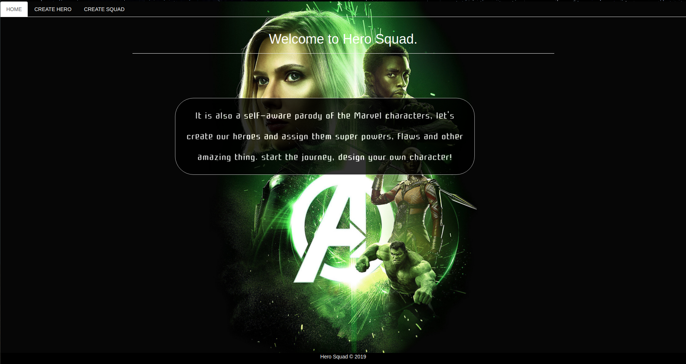
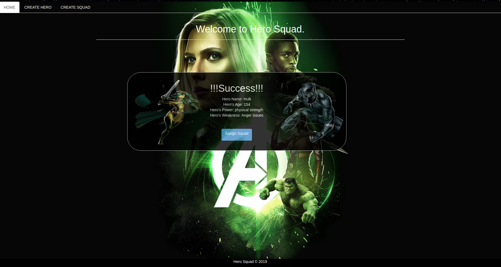
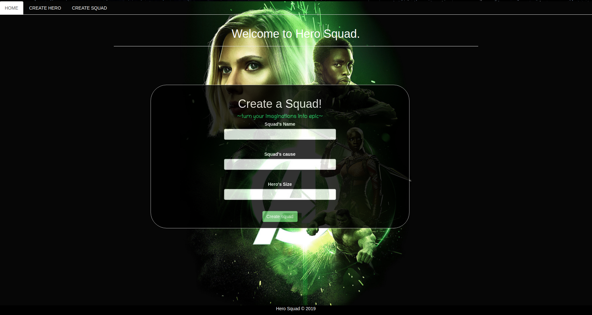
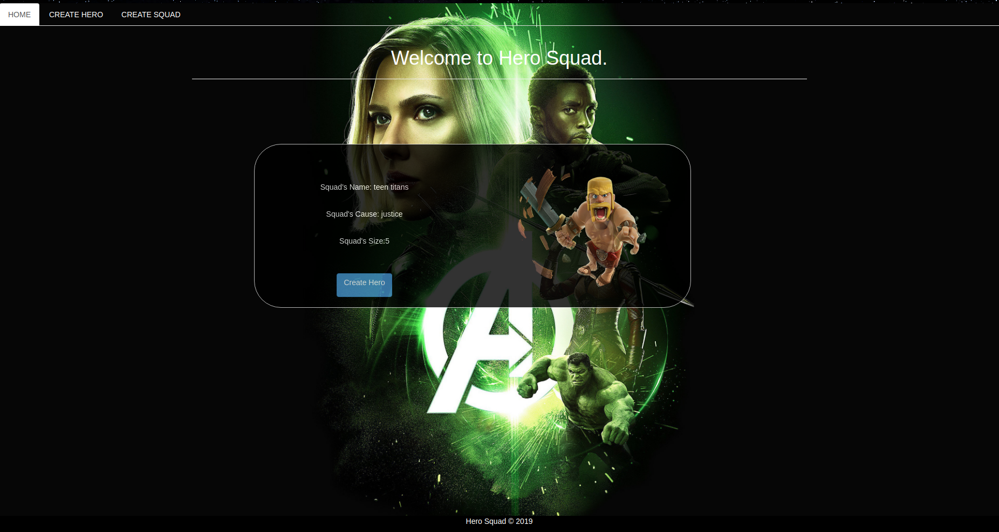

# Hero Squad

## *By Sangwa Sabine Chelsea*

## Description

This is an app that helps the user to create create a hero and allows you to recruit a well-balanced team of superheroes in your squad.

## Pre-requisites

  1. Ensure you have Java installed 
     (A simple way to install Java is using sdkman.)
     
    sdk install java
  
  2.Gradle
    Gradle is used as the build tool and can be installed with sdkman:
  
    sdk install gradle
      
## Installation guide   
{follow the below instructions for set up.}
    
   1. You will need Internet connection.

   2. You need to get into the Hero-Squad Repository.
    
     Link:-> https://github.com/Sangwa-C/Hero-squad.git
        
   3. From there you can access the Hero-Squad.
    
   4. Clone the project.
    
   5. get into project folder (cd into project).

   6. If you have all the Pre-requisites you can run the application.
    
     gradle run

## BDD

**The program should allow the user to creat a Hero.**

    Input Example: "Hero's Name: Hulk"
                   "Hero's Age: 154"
                   "Hero's Power: physical strength"
                   "Hero's Weakness: Anger issues"

**The program should return when the user creates a hero** 

    Output Example: "Hero Name: Hulk"
                    "Hero's Age: 154"
                    "Hero's Power: physical strength"
                    "Hero's Weakness: Anger issues"
    
**The program should allow the user to creat a Squad.** 

    Input Example: "Squad's Name: Teen-Titens"
                   "Squad's Cause: Justice"
                   "Squad's Size: 5"
                   
 **The program should return when the user creates a hero** 
     
      Output Example: "Squad's Name: Teen-Titens"
                      "Squad's Cause: Justice"
                      "Squad's Size: 5"
     
 **Here are some screenshots from the project**
 
 
 
   
 
## Known Bugs

This webpage is not suitable for all screen sizes and it might load slowly if your internet is low.

## Technologies Used

* JAVA
* Gradle
* Spark
* HTML
* CSS & Bootstrap
* Junit
 
## Support and contact details
If you any issues or have questions, ideas or concerns contact us on chelseasabinesangwa@gmail.com.

### License
MIT Copyright (c) 2019 Sangwa Sabine Chelsea. #Hero_Squad 
